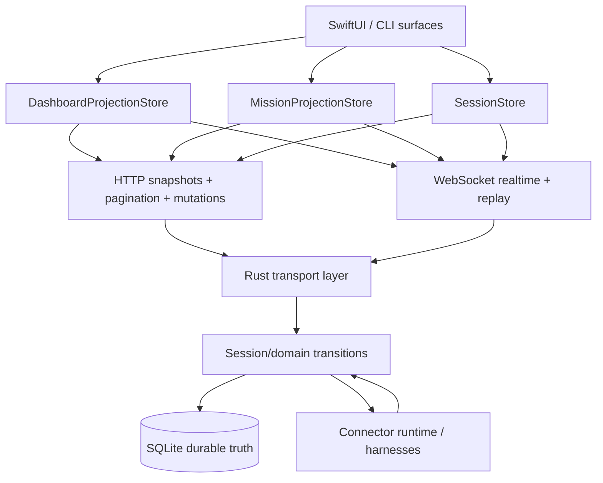
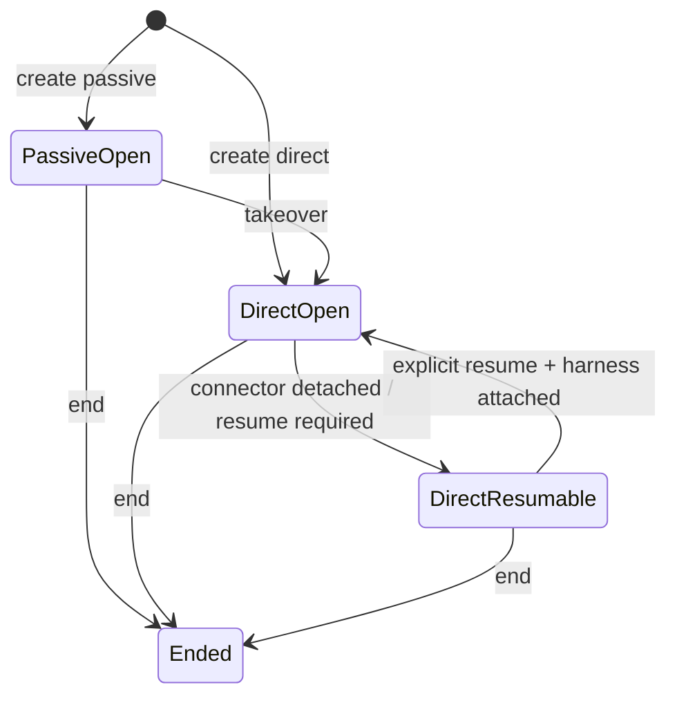

# OrbitDock Data Flow Contract

This is the current server-authoritative contract for OrbitDock.

The short version:

- HTTP owns initial and heavy reads.
- WebSocket owns realtime updates and replay.
- The Rust server owns durable business truth.
- The client renders server state. It does not reconstruct business state from connector internals.
- WebSocket begins with a lightweight `hello` handshake that advertises `server_version`, a server-authored `compatibility` verdict, and surface capabilities.

Today’s important nuance:

- HTTP is the only bootstrap path.
- WebSocket carries deltas, replay, heartbeats, and explicit resync/refetch hints only.
- If replay cannot satisfy a revision gap, the client refetches the matching HTTP surface.
- Compatibility is server-authored. Clients should fail fast when the server says the pair is incompatible instead of guessing.

## Architecture Diagram

The rule of thumb:

- HTTP loads authoritative surface state.
- WebSocket only delivers incremental realtime change or replay from a known revision.
- The domain layer decides business state.
- SQLite stores that business state durably.
- Connector runtime is operational plumbing, not product truth.

## Session Authority Diagram

## Principles

1. HTTP is the bootstrap path.
   Dashboard, session bootstrap, and pagination all start from HTTP.
2. WebSocket is the follow-up path.
   After the client has a snapshot revision, it subscribes for realtime updates and replay from that revision.
3. Session authority lives on the server.
   `control_mode`, `lifecycle_state`, and `accepts_user_input` are server-owned fields.
4. Mutation responses are authoritative.
   Successful `POST`/`PATCH`/`PUT` responses are applied immediately by the client. WS reconciles afterward.

## Boundary Rules

- The client may derive presentation, never business truth.
- The Rust domain layer owns `control_mode`, `lifecycle_state`, and `accepts_user_input`.
- Runtime connector maps may support those fields, but they do not define them.
- Large payloads move over HTTP. WebSocket should carry deltas, replay, heartbeats, and refetch hints.
- Replay gaps are handled by refetching the exact affected HTTP surface, not by rebuilding unrelated state.
- Each surface has one bootstrap path and one realtime path.

## Surface Model

OrbitDock now treats UI data as named surfaces instead of one catch-all session blob.

### Dashboard

- HTTP: `GET /api/dashboard`
- WS subscribe: `subscribe_dashboard { since_revision }`
- Purpose:
  - root session list
  - dashboard conversations
  - dashboard counts

### Missions

- HTTP: canonical missions snapshot endpoint
- WS subscribe: `subscribe_missions { since_revision }`
- Purpose:
  - mission summaries
  - mission realtime deltas

### Session Detail

- HTTP state source: session bootstrap payload
- WS subscribe: `subscribe_session_surface { session_id, surface: detail, since_revision }`

### Session Composer

- HTTP state source: session bootstrap payload
- WS subscribe: `subscribe_session_surface { session_id, surface: composer, since_revision }`

### Conversation

- HTTP bootstrap: `GET /api/sessions/{id}/conversation?limit=...`
- HTTP pagination: `GET /api/sessions/{id}/messages?before_sequence=...&limit=...`
- WS subscribe: `subscribe_session_surface { session_id, surface: conversation, since_revision }`

## Boot Sequences

### Dashboard Boot

1. WebSocket connects and receives `hello`.
2. Client fetches `GET /api/dashboard`.
3. Client applies the snapshot and stores its revision.
4. Client subscribes to dashboard updates with `since_revision = snapshot.revision`.

There should not be a second eager dashboard bootstrap path in parallel.

### Session Boot

1. Client fetches `GET /api/sessions/{id}/conversation?limit=...`.
2. Client applies the returned `session` to detail and composer state.
3. Client applies the returned rows to conversation state and stores `session.revision`.
4. Client subscribes to the WS surfaces it renders with `since_revision = session.revision`.

Conversation screens usually need:

1. session bootstrap HTTP
2. conversation WS replay/deltas
3. detail WS replay/deltas

Composer screens usually need:

1. session bootstrap HTTP
2. composer WS replay/deltas
3. conversation HTTP/WS only if the composer screen also renders history

## Replay Rules

- Every replayable WS subscription accepts `since_revision`.
- If the server can replay from that revision, it sends only the missing events.
- If the replay window is too old or unavailable, the server tells the client to refetch that surface over HTTP.
- The client must treat HTTP refetch as the fallback, not try to synthesize missing state locally.

## Durable Session Authority

The server is responsible for these fields:

- `control_mode`
  - `direct`
  - `passive`
- `lifecycle_state`
  - `open`
  - `resumable`
  - `ended`
- `accepts_user_input`

The intended model is:

- `direct + open` means OrbitDock owns the live control path.
- `passive + open` means the underlying provider session is live, but OrbitDock does not own direct control.
- `direct + resumable` means this is still a direct session, but it needs a resume path rather than immediate input.
- `ended` means historical only.

The client should never infer these from connector maps, missing channels, or transcript patterns.

## Conversation Row Rules

- Conversation rows remain single-writer, server-assigned, and sequence-based.
- HTTP bootstrap and pagination return server-owned ordering metadata:
  - `total_row_count`
  - `has_more_before`
  - `oldest_sequence`
  - `newest_sequence`
- WS conversation updates carry row changes and replay events, not full raw tool payloads.
- Expanded tool content is still fetched on demand via HTTP.

## Send Semantics

`POST /api/sessions/{id}/messages` must obey this contract:

1. connector enqueue succeeds
2. server persists and broadcasts the accepted row
3. HTTP response returns the authoritative accepted row
4. client applies the response immediately

If connector enqueue fails:

- the server returns an error such as `connector_unavailable`
- no accepted conversation row is created
- the client keeps the draft locally and shows the failure

## What We Intentionally Avoid

- No dual bootstrap for the same surface.
- No client-owned business-state inference.
- No “accept first, fail later” send path that leaves ghost rows behind.
- No using WebSocket as the only source for large initial payloads.
- No broad god-object session store that synthesizes every UI surface from one mixed state blob.
- No durable state transitions driven implicitly by runtime channel presence alone.
- No heavy all-rows websocket resync when a targeted HTTP refetch hint would do.
